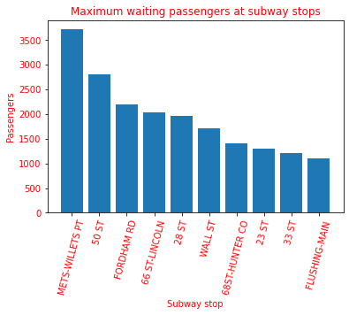

# Seeking out idle passengers based upon traffic and train frequency

The goal of this project is to identify the time and place in the MTA subway system where there are the greatest number of passengers waiting for their train.

The model takes into account the passenger entries over a period of time and references the frequency of trains during that time in order to identify situations where there are few trains running relative to the number of passengers waiting to enter. A preliminary scan over three weeks' worth of data identifies that Mets games have the most congestion during this time period. While it is known that there is a special train schedule for these events, it is a good sign that the model is working properly to identify instances of a high number of entries while accounting for the frequency of scheduled trains.

Further analysis will look over a greater span of time to see if there are any week-to-week trends.
